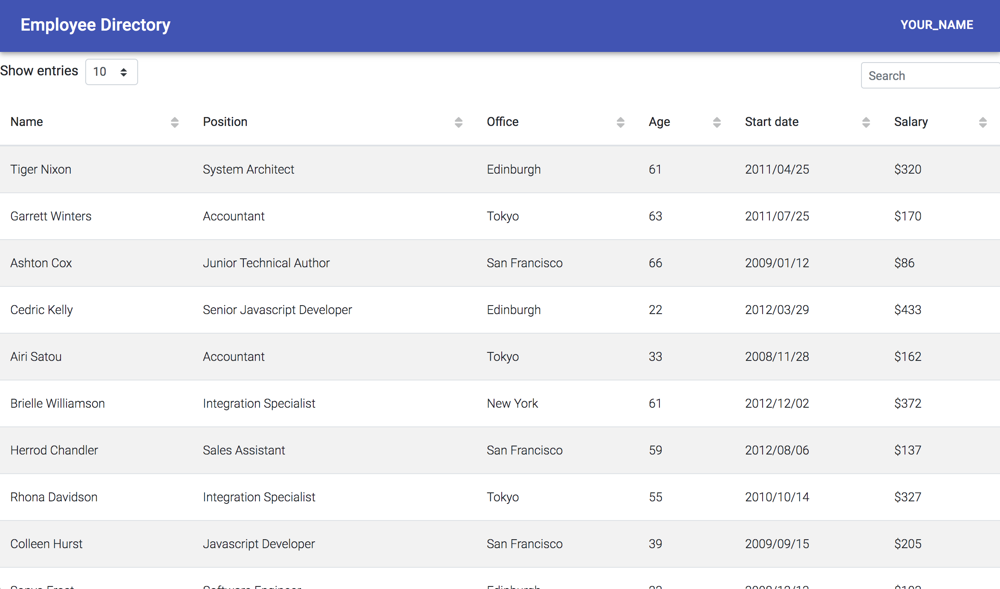

## Overview

Created an employee directory with React using components and largely the mdbreact framework.

## User Story

* As a user, I want to be able to view my entire employee directory at once so that I have quick access to their information.

## Business Context

An employee or manager would benefit greatly from being able to view non-sensitive data about other employees. It would be particularly helpful to be able to filter employees by name.

## Screenshot

## Links

* the URL to the deployed application
https://peaceful-shelf-39833.herokuapp.com/

* the URL to the Github repository
https://github.com/Bscott95/employee-directory 

## License
Licensed under the MIT License
Copyright 2020 Brandon Scott
